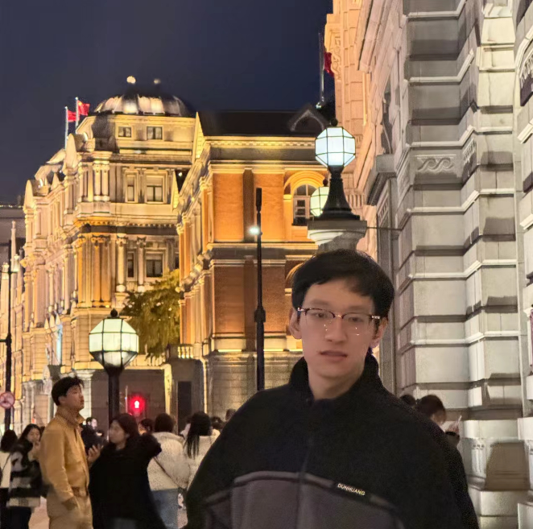

<meta name="referrer" content="no-referrer"/>

## Biography

I am an undergraduate at University of Electronic Science and Technology of China ([UESTC](https://en.uestc.edu.cn/)), majoring in Software Engineering. From January to July 2024, I worked as an intern at [ByteDance](https://www.bytedance.com/).Before that,I learned c++ related content.

Now I am studying on my own the fields related to artificial intelligence large models to lay the foundation for my graduate studies.

## Education

* Sept. 2021 - July 2025 (expected), Bachelor in School of Information and Software
* GPA:  **3.90 / 4.00**, Rank: **18 / 151**

## Selected Honors and Awards

* Outstanding Student Scholarship Of UESTC 2022
* Outstanding Student Scholarship Of UESTC 2023
* The National Grand Prize of Chinese Collegiate Computing Competition(**4C**)